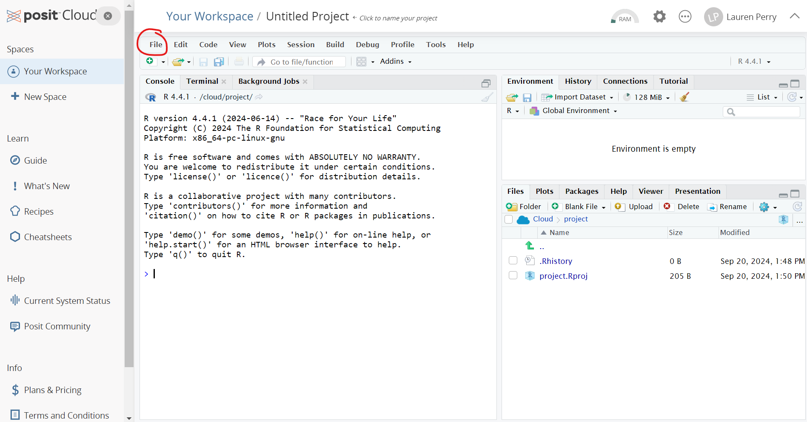
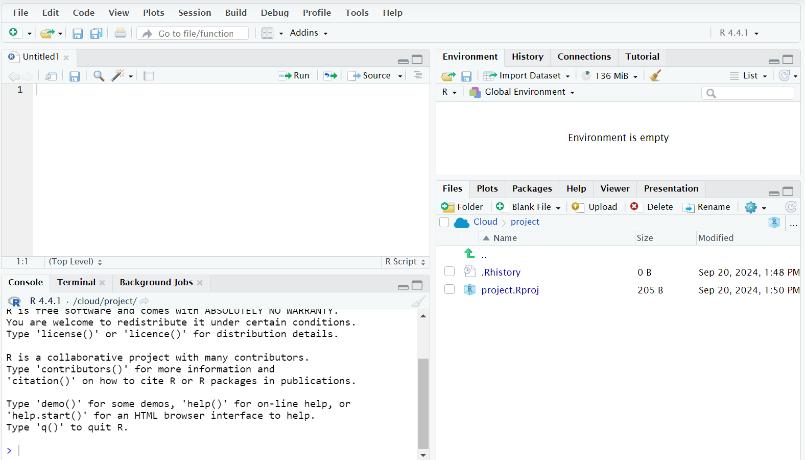

```{r setup, include=FALSE, message=FALSE, warning = FALSE}
knitr::opts_chunk$set(echo = FALSE)
library(MASS)
```

# Welcome to Statistics! {.unnumbered}

## For the Student {.unnumbered}

There are a lot of ways to approach an introductory statistics class. Historically, the topics found in these course notes have been taught in a way that emphasizes hand calculations and the use of tables full of numbers.

My philosophy is a little different. This class is designed for students who will need to read statistical results and may need to produce basic statistics using a computer. If you go on to be a scientist and need more statistical know how, this course will give you enough background knowledge to take the inevitable next course in statistics. There is plenty of math here, but none of these situations require the ability to do that math by hand.

In many sections, the math is provided and explained but not emphasized. This is intentional. Instead, we focus on the "why"... Why do we care about this topic? Why is this concept important? Why do I run this test when I have that kind of data? ...and we focus on the interpretation. What does this number tell us about an experiment? What can we conclude based on these statistical results?

We see statistics all the time in the media - in the form of graphs, tables, averages, predictions about elections or sports, you name it! Hopefully, by learning the whys and the interpretation, you will finish this text feeling like you can read and understand statistical results when you run into them in the real world.

### R Programming {.unnumbered}

This text is designed to teach you introductory statistics with the option to learn some R (a statistical programming language) along the way. As a result, some sections have some introductory material on R. R is an incredibly powerful tool, but we’re going to keep it relatively simple. Using R will save us the headache of doing a lot of calculations by hand.

For right now, you can run R right here in the course notes! This is exactly what you will see on the rdrr.io website. Type in your command and click the green "Run" button. Try running the command `print("Welcome to Statistics!")`.

<iframe width="100%" height="500" src="https://rdrr.io/snippets/embed/?code=" frameborder="0">

</iframe>

If it prints out "Sorry, something went wrong. All I know is:", just press the "Run" button again.

As we progress, we will run it completely online at the website <a href="https://posit.cloud/" target="blank">posit.cloud</a>. You do need to create an account to use this website. This will allow you to save your work as you go. I strongly recommend you bookmark this website and it to run the code alongside the R labs. 

If you prefer, you can also download R and RStudio to your computer. There are basic instructions <a href="https://rstudio-education.github.io/hopr/starting.html">here</a>.

Let's take a look at Posit Cloud. When you first log in, you will see a landing page that says "Your Content". On the upper right part of the screen you should see a button that says "New Project". Click on the button and select "New RStudio Project" from the dropdown menu. 



Click on "File" (circled in red above) then "New File" and "R Script" to get the following four "panels":



We will take a look at each panel in turn.

1. *Bottom left*: This is the R command console, where you will type your R commands to be run immediately. It's possible to do everything discussed in these course notes without ever leaving this panel! Whenever you finish typing an R command, just hit "Enter" on your keyboard to run it. If you made a mistake before pressing enter, you can press the up arrow on your keyboard to get the line of code back so that you can edit it. 
2. *Top left*: This is a place where you can write (and edit) multiple lines of R commands at once. To run one of these lines, press the "Run" button at the top right of the panel. This is also a good place to write code if you want to save it for later. Selecting the save icon will allow you to save whatever code you've written here directly to your posit.cloud account (or to your computer, if you are working locally in RStudio).
3. *Bottom right*: This is where any plots/data visualizations will appear.
4. *Top right*: This is where stuff stored in the R environment will appear. 

## For the Instructor {.unnumbered}

Thanks for checking out my Introduction to Statistics course! Sections are designed to be short, easy-to-read introductions to each concept. Some of the more conceptual sections do not have section exercises, but I am working on adding exercises wherever it seems appropriate. The topics and course ordering reflect the department syllabus for the 3-unit Introduction to Statistics at Sacramento State. I am sure there are topics we've left out, but there are only so many things one can cover in 15 weeks.

Each module after the first is designed to take approximately two weeks of class time. In an ideal world, I would cover at least the first nine in a 15 week semester. However, with assessment, activities, student questions, holidays, etc., I usually get through the first eight. Despite the time constraints, I am slowly working on including additional topics.

These notes are a work in progress and gets updated each semester that I each Introduction to Statistics (which is very nearly every semester) and sometimes during winter and summer breaks.

Currently, I am focused on creating more in-class worksheets and activities. Solutions to these, and the text's exercise problems, are provided to students through the learning management system. 

Slides for many of the sections are available on my website: <a href="https://lgpperry.github.io/teaching/stat1/">lgpperry.github.io/teaching/stat1/</a>, although these days I present mostly by writing on the board.

Please feel free to reach out to me with any questions, comments, or concerns by emailing me at perry\@csus.edu

## Course Learning Outcomes {.unnumbered}

The CLOs for Stat 1: Introduction to Statistics at Sacramento State are as follows.

Students will be able to:

1.  Organize, summarize, and interpret data in tabular, graphical, and pictorial formats.
2.  Organize and interpret bivariate data and learn simple linear regression and correlation.
3.  Understand the basic rules of probability.
4.  Use the binomial distribution as a model for discrete variables.
5.  Use the normal distribution as a model for continuous variables.
6.  Apply statistical inference techniques of parameter estimation such as point estimation and confidence interval estimation.
7.  Apply techniques of testing various statistical hypotheses concerning population parameters.

Stat 1 is also a General Education Area B4 course. The Area B4 learning outcomes are as follows.

Students will be able to:

A.  Solve problems by thinking logically, making conjectures, and constructing valid mathematical arguments.
B.  Make valid inferences from numerical, graphical and symbolic information.
C.  Apply mathematical reasoning to both abstract and applied problems, and to both scientific and non-scientific problems.

Each module also has module-specific learning outcomes and their corresponding CLOs. (The Area B4 outcomes are not included, as each module addresses all three outcomes.)

<p xmlns:cc="http://creativecommons.org/ns#" xmlns:dct="http://purl.org/dc/terms/"><a property="dct:title" rel="cc:attributionURL" href="https://bookdown.org/lgpperry/introstats/">Introduction to Statistics</a> by <a rel="cc:attributionURL dct:creator" property="cc:attributionName" href="https://lgpperry.github.io/">Lauren Perry</a> is licensed under <a href="https://creativecommons.org/licenses/by-nc-sa/4.0/?ref=chooser-v1" target="_blank" rel="license noopener noreferrer" style="display:inline-block;">CC BY-NC-SA 4.0</a></p>
